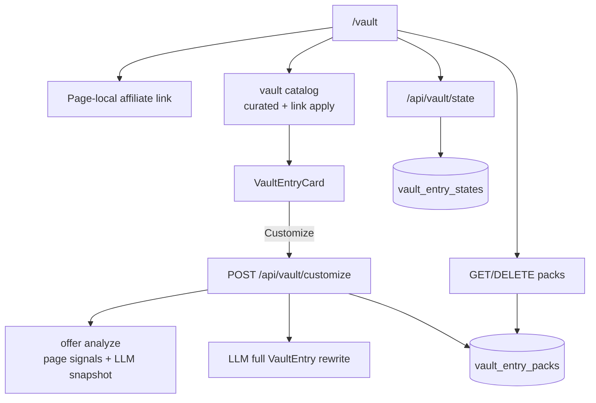

# Quora + Pinterest Vault Offer Packs Design

**Date:** 2026-08-12  
**Status:** Approved for planning  
**Mirrors:** [2026-08-12-shorts-vault-offer-packs-design.md](./2026-08-12-shorts-vault-offer-packs-design.md) for `/vault` (Quora + Pinterest).  
**Supersedes (page UX only):** filter/browse model and global-link wiring on `/vault`. Curated content types, `validate-vault`, rubric, and `vault_entry_states` reuse remain in force unless this doc says otherwise.

## Summary

Evolve `/vault` from a filtered static library into a guided workflow: **page-local affiliate link → niche → curated Quora/Pinterest posts (instant)** with optional **offer-aware AI customize per entry**. Customized entries persist as **single-entry packs** in Supabase (**My library**). Remove the **Filter the library** section. Enhance curated post quality and card UX.

## Goals

1. Make the affiliate link an explicit first step on this page (page-local, not global SearchContext).
2. Keep curated browse instant (zero LLM) while offering deep personalization on demand.
3. Customize entries from the affiliate page (scrape/summarize → full rewrite) and save each result as an account-backed pack.
4. Remove platform / saved-only / hide-used filter UI; keep saved/used toggles on cards.
5. Improve curated Quora/Pinterest copy quality and card clarity for Customize / library.

## Non-goals

- Batch customize of an entire niche in one click.
- Syncing Vault link into global `SearchContext.affiliateLink`.
- Platform filter chips or Saved-only / Hide-used filter bar.
- Changes to `/shorts-vault` behavior or `shorts_script_packs`.
- Replacing curated content with AI-only generation as the default path.
- Unifying Shorts + Vault into one shared packs table (deferred; parallel pattern by design).

## Decisions

| Topic | Choice |
|---|---|
| Content default | Curated static entries, instant |
| AI mode | Hybrid: optional per-entry customize |
| Customize depth | Offer-aware pack: fetch page signals → analyze offer → full VaultEntry rewrite |
| Pack granularity | One customized entry = one pack row |
| Pack storage | Supabase table + RLS (account-backed), separate from Shorts |
| Affiliate link | Page-local only (`localStorage` key for Quora/Pinterest Vault) |
| Filters | Remove Filter the library section entirely |
| Saved/used | Keep on curated cards via existing `vault_entry_states` |
| Duplicate customize | Upsert by `(user_id, source_entry_id, affiliate_link)` |
| Content enhance | Editorial pass on all curated niche files + card UX polish |

## Workflow & page UX

Step order on `/vault`:

1. **Paste your affiliate link** — text input, `http`/`https` validation, page-local state persisted under `acw.vault.affiliateLink`. Does not call `setAffiliateLink` from SearchContext. Empty link: curated entries still render; `__LINK__` substitutes to a clean placeholder via existing `substituteLink` / `applyAffiliateLink`. Customize requires a valid URL.
2. **Choose your niche** — existing `NichePicker`.
3. **Copy / customize** — curated Quora + Pinterest entries for the niche with page-local link applied. No Filter the library block. Platform badges remain informational on cards. Each card: Copy actions, Saved, Used, and **Customize to my offer** (disabled/error until valid link).
4. **My library** — list of the user’s packs (newest first): open/copy/delete. Empty state explains customize-to-save. Loaded after hydrate; must not block curated list render.

Quiet optional “X of Y used” may sit under the curated list header; it must not resurrect a filter section.

Tutorial copy and page subtitle update to match link → niche → posts → optional customize.

## Architecture



## Data model

### Table `vault_entry_packs`

| Column | Type | Notes |
|---|---|---|
| `id` | UUID PK | `gen_random_uuid()` |
| `user_id` | UUID FK → `auth.users` | ON DELETE CASCADE |
| `source_entry_id` | TEXT | Curated id, e.g. `q-mmo-01`, `p-mmo-01` |
| `niche_id` | TEXT | App niche id |
| `affiliate_link` | TEXT | Exact URL used for this pack |
| `offer_snapshot` | JSONB | Product name, promise, audience, angles, etc. |
| `entry` | JSONB | Full rewritten `VaultEntry` with real link in answer or pinDescription |
| `created_at` | TIMESTAMPTZ | default now() |
| `updated_at` | TIMESTAMPTZ | default now() |

Constraints:

- `UNIQUE (user_id, source_entry_id, affiliate_link)` for upsert-on-recustomize.
- RLS: users manage only their own rows (`auth.uid() = user_id`).
- Index on `user_id` (and optionally `created_at DESC` for list).

### Types

Reuse `VaultEntry` / `QuoraEntry` / `PinterestEntry`. Add a pack DTO:

```ts
export type VaultEntryPack = {
  id: string;
  sourceEntryId: string;
  nicheId: NicheId;
  affiliateLink: string;
  offerSnapshot: OfferSnapshot;
  entry: VaultEntry;
  createdAt: string;
  updatedAt: string;
};
```

Persist the full offer snapshot JSON from `analyzeOffer` for simplicity (same as Shorts).

## API

### `POST /api/vault/customize`

Auth required. Body: `{ entryId: string, affiliateLink: string, nicheId: NicheId }`.

Pipeline:

1. Validate auth, `isVaultEntryId(entryId)`, `sanitizeExternalUrl(affiliateLink)`. Load curated seed via `getVaultEntryById`; reject if missing or if `nicheId` ≠ `seed.nicheId`.
2. Analyze offer: reuse DFY `analyzeOffer` / page-signal patterns (`safe-url`, short fetch timeout). On fetch/analyze failure, degrade to hostname + niche + seed metadata (still attempt rewrite).
3. LLM: full rewrite of platform fields for the offer.
   - **Quora:** rewrite `angle`, `question`, `searchQuery`, `answer`, `topics`. Keep `id`, `platform`, `nicheId`. Answer contains the **real affiliate URL exactly once** (no `__LINK__`). No URL/`__LINK__` in question or searchQuery.
   - **Pinterest:** rewrite `angle`, `pinTitle`, `pinDescription`, `boardName`, `imageConcept`, `keywords`. Keep `id`, `platform`, `nicheId`. Description contains the **real affiliate URL exactly once**. No URL/`__LINK__` in pinTitle, boardName, or imageConcept.
4. Validate returned JSON against the matching `VaultEntry` shape (required fields, platform discriminant, link rules). Hard fail if Pinterest `pinTitle` >100 or `pinDescription` >500, or if link rules fail. Quora answers should be ≥180 words; if under after first parse, retry once; if still short but ≥120 and otherwise valid, accept. On hard failure after retry: 422 with clear message.
5. Upsert into `vault_entry_packs` on `(user_id, source_entry_id, affiliate_link)`.
6. Return `{ pack: VaultEntryPack }`.

### `GET /api/vault/packs`

Auth required. Returns `{ packs: VaultEntryPack[] }` newest first.

### `DELETE /api/vault/packs/[id]`

Auth required. Owner-only delete. 404 if missing/not owned.

## Curated path changes

- Page stops reading `affiliateLink` from `useSearch` for substitution; uses page-local link instead.
- Remove platform filter state, Saved-only, Hide-used, and `PLATFORM_KEY` usage from the page (catalog `platform` helper may remain for future; UI must not expose it).
- `applyAffiliateLink` continues `__LINK__` substitution on answer / pinDescription.
- Enhance all curated niche files for stronger openings, clearer usefulness, and natural link framing; keep `npm run validate:vault` green.

## Content quality rules (customize + curated)

- Follow `src/lib/vault/content/RUBRIC.md` for curated authoring.
- Quora curated: ≥180 words; `__LINK__` exactly once in `answer`; link in last third as a resource, not the pitch.
- Pinterest curated: `pinTitle` ≤100; `pinDescription` ≤500 with `__LINK__` once; specific boardName / imageConcept; 4–8 keywords.
- Customize output must feel specific to the offer snapshot (product name / promise / audience), not generic niche filler.
- Honest claims; no spam triggers (ALL CAPS, guaranteed income, “click here”, etc.).
- Never mention AI CashWave / internal product names in pasteable copy.
- Packs store the real URL (no leftover `__LINK__`) in the body field that previously held the placeholder.

## Performance & scaling

- Curated list: client filter by niche only; no network except saved/used + packs list.
- Packs list: fetch after hydrate in parallel with vault state; skeletons for My library only.
- Customize: one LLM rewrite per request; per-card pending UI; do not block other cards.
- Offer fetch: hard timeout (align with DFY ~8s); degraded path if page blocked.
- Optional later (not required v1): client pass-through of prior `offerSnapshot` for same URL to skip re-analyze.
- Keep route code-split; no new global providers.

## Error handling

| Case | Behavior |
|---|---|
| Invalid/empty link on Customize | Inline error; focus link field; no API call |
| Packs/state load failure | Inline error + retry; curated still usable |
| Customize failure | Inline error on the card; curated entry unchanged |
| Delete | Confirm; optimistic remove with rollback on failure |
| Unauthenticated API | Same pattern as `/api/vault/state` |

## Files

### New

| Path | Purpose |
|---|---|
| `supabase/migrations/20260812190000_vault_entry_packs.sql` | Table + RLS + unique index |
| `src/app/api/vault/customize/route.ts` | Offer-aware rewrite + upsert |
| `src/app/api/vault/packs/route.ts` | List packs |
| `src/app/api/vault/packs/[id]/route.ts` | Delete pack |
| `src/lib/vault/vault-packs.ts` | Types + mappers / validation helpers |
| `src/lib/vault/vault-customize.ts` | Prompt + parse/validate rewrite (server) |

### Modified

| Path | Change |
|---|---|
| `src/app/vault/page.tsx` | New workflow; remove filters; packs library; page-local link |
| `src/components/vault/VaultEntryCard.tsx` | Customize action + pending/error state |
| `src/lib/vault/content/*.ts` (niche files, not shorts/) | Entry quality enhancements |
| Tutorial / subtitle copy on the page | Match new workflow |

### Untouched (reuse)

`vault_entry_states`, `/api/vault/state`, `types.ts` entry unions, `catalog.ts` (minus UI platform filter), `validate-vault.mjs`, DFY `analyzeOffer` / page-signal patterns, `sanitizeExternalUrl`, `NichePicker`, `CopyButton`, `PageHeader`, `TutorialVideoSection`, Shorts Vault packs/APIs.

## Testing / verification

1. `npm run validate:vault` passes after content edits.
2. Typecheck / lint / build clean.
3. Manual: paste link → pick niche → posts show with link in answer/description; Filter section gone.
4. Manual: Customize one Quora and one Pinterest entry → appear in My library; recustomize same source+link updates same pack.
5. Manual: delete pack; invalid link blocks customize; curated works with empty link.
6. Manual: saved/used still persist for curated ids; packs do not appear on `/shorts-vault`.

## Open follow-ups (explicitly deferred)

- Passing cached `offerSnapshot` into customize to skip re-analyze.
- Marking curated source `used` automatically when a pack is created.
- Restoring soft platform filter as a non-primary control.
- Unifying Shorts + Vault pack storage into one table.
