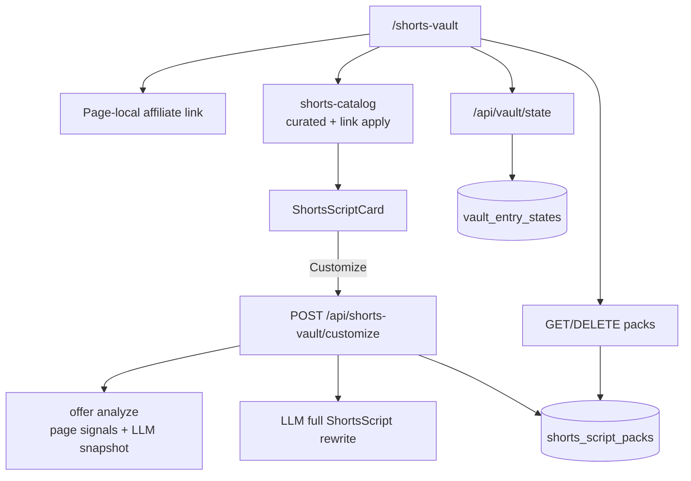

# Shorts Vault Offer Packs Design

**Date:** 2026-08-12  
**Status:** Approved for planning  
**Supersedes (page UX only):** filter/browse model and global-link wiring in [2026-08-12-viral-shorts-vault-design.md](./2026-08-12-viral-shorts-vault-design.md). Curated content types, validator, and `vault_entry_states` reuse remain in force unless this doc says otherwise.

## Summary

Evolve `/shorts-vault` from a filtered static library into a guided workflow: **page-local affiliate link → niche → curated scripts (instant)** with optional **offer-aware AI customize per script**. Customized scripts persist as **single-script packs** in Supabase (**My library**). Remove the **Filter the library** section. Enhance curated script quality and page performance/UX.

## Goals

1. Make the affiliate link an explicit first step on this page (page-local, not global SearchContext).
2. Keep curated browse instant (zero LLM) while offering deep personalization on demand.
3. Customize scripts from the affiliate page (scrape/summarize → full rewrite) and save each result as an account-backed pack.
4. Remove platform / saved-only / hide-used filter UI; keep saved/used toggles on cards.
5. Improve script copy quality and page clarity/speed.

## Non-goals

- Batch customize of an entire niche in one click.
- Syncing Shorts Vault link into global `SearchContext.affiliateLink`.
- Platform filter chips or Saved-only / Hide-used filter bar.
- Video rendering, thumbnails, or asset pipelines.
- Changes to `/vault` (Quora + Pinterest) behavior.
- Replacing curated content with AI-only generation as the default path.

## Decisions

| Topic | Choice |
|---|---|
| Content default | Curated static scripts, instant |
| AI mode | Hybrid: optional per-script customize |
| Customize depth | Offer-aware pack: fetch page signals → analyze offer → full script rewrite |
| Pack granularity | One customized script = one pack row |
| Pack storage | Supabase table + RLS (account-backed) |
| Affiliate link | Page-local only (`localStorage` key for Shorts Vault) |
| Filters | Remove Filter the library section entirely |
| Saved/used | Keep on curated cards via existing `vault_entry_states` |
| Duplicate customize | Upsert by `(user_id, source_script_id, affiliate_link)` |

## Workflow & page UX

Step order on `/shorts-vault`:

1. **Paste your affiliate link** — text input, `http`/`https` validation, page-local state persisted under `acw.shorts-vault.affiliateLink`. Does not call `setAffiliateLink` from SearchContext. Empty link: curated scripts still render; `__LINK__` substitutes to a clean placeholder via existing `substituteLink`. Customize requires a valid URL.
2. **Choose your niche** — existing `NichePicker`.
3. **Copy / film / customize** — curated scripts for the niche with page-local link applied. No Filter the library block. Platform badges remain informational on cards. Each card: Copy, Saved, Used, and **Customize to my offer** (disabled/error until valid link).
4. **My library** — list of the user’s packs (newest first): open/copy/delete. Empty state explains customize-to-save. Loaded after hydrate; must not block curated list render.

Quiet optional “X of Y used” may sit under the curated list header; it must not resurrect a filter section.

Tutorial copy and page subtitle update to match link → niche → scripts → optional customize.

## Architecture



## Data model

### Table `shorts_script_packs`

| Column | Type | Notes |
|---|---|---|
| `id` | UUID PK | `gen_random_uuid()` |
| `user_id` | UUID FK → `auth.users` | ON DELETE CASCADE |
| `source_script_id` | TEXT | Curated id, e.g. `s-mmo-01` |
| `niche_id` | TEXT | App niche id |
| `affiliate_link` | TEXT | Exact URL used for this pack |
| `offer_snapshot` | JSONB | Product name, promise, audience, angles, etc. |
| `script` | JSONB | Full rewritten `ShortsScript` with real link in caption |
| `created_at` | TIMESTAMPTZ | default now() |
| `updated_at` | TIMESTAMPTZ | default now() |

Constraints:

- `UNIQUE (user_id, source_script_id, affiliate_link)` for upsert-on-recustomize.
- RLS: users manage only their own rows (`auth.uid() = user_id`).
- Index on `user_id` (and optionally `created_at DESC` for list).

### Types

Reuse `ShortsScript` / `ShortsBeat`. Add a pack DTO that stores a narrowed offer snapshot (productName, mainPromise, targetAudience, strongestAngle, contentAngles at minimum — same fields DFY `OfferSnapshot` already provides; persist the full snapshot JSON from `analyzeOffer` for simplicity):

```ts
export type ShortsScriptPack = {
  id: string;
  sourceScriptId: string;
  nicheId: NicheId;
  affiliateLink: string;
  offerSnapshot: OfferSnapshot;
  script: ShortsScript;
  createdAt: string;
  updatedAt: string;
};
```

## API

### `POST /api/shorts-vault/customize`

Auth required. Body: `{ scriptId: string, affiliateLink: string, nicheId: NicheId }`.

Pipeline:

1. Validate auth, `isShortsScriptId(scriptId)`, `sanitizeExternalUrl(affiliateLink)`. Load curated seed via `getShortsScriptById`; reject if missing or if `nicheId` ≠ `seed.nicheId`.
2. Analyze offer: reuse DFY `analyzeOffer` / page-signal patterns (`safe-url`, short fetch timeout). On fetch/analyze failure, degrade to hostname + niche + seed metadata (still attempt rewrite).
3. LLM: full rewrite of hook, beats, CTA, caption, hashtags, visualStyle, soundNote. Keep seed `id`, `nicheId`, `format`, `durationSeconds`, `platforms`, and beat count/timing model compatible with validator rules. Caption contains the **real affiliate URL exactly once** (no `__LINK__` left in saved pack script). Spoken fields must not contain raw URLs; CTA remains bio/soft close but offer-specific. Faceless visuals only.
4. Validate returned JSON against `ShortsScript` shape (required fields, beats length, caption contains link, no `__LINK__` in spoken fields). On failure: one retry; then 422 with clear message.
5. Upsert into `shorts_script_packs` on `(user_id, source_script_id, affiliate_link)`.
6. Return `{ pack: ShortsScriptPack }`.

### `GET /api/shorts-vault/packs`

Auth required. Returns `{ packs: ShortsScriptPack[] }` newest first.

### `DELETE /api/shorts-vault/packs/[id]`

Auth required. Owner-only delete. 404 if missing/not owned.

## Curated path changes

- Page stops reading `affiliateLink` from `useSearch` for substitution; uses page-local link instead.
- Remove platform filter state, Saved-only, Hide-used, and PLATFORM_KEY usage from the page (platform filter helper may remain unused in catalog for now or stay available for future; UI must not expose it).
- `applyAffiliateLinkToScript` continues caption `__LINK__` substitution; content pass strengthens CTA/caption so the link’s role is obvious after substitution.
- Enhance all 40 curated scripts for stronger hooks, clearer beats, and better CTA/caption; keep `npm run validate:shorts` green.

## Script quality rules (customize + curated)

- Faceless-first; no on-camera requirement.
- Duration 25–45s; contiguous timecodes ending at `durationSeconds`.
- Hook ≤ 140 characters.
- Caption ≤ 2200 characters; curated uses `__LINK__` exactly once; packs use the real URL exactly once.
- No `__LINK__` or raw URL in `hook`, `beats[].voiceover`, `beats[].onScreen`, or `cta`.
- Honest claims; health/money/pet deferrals unchanged from existing editorial voice.
- Customize output must feel specific to the offer snapshot (product name / promise / audience), not generic niche filler.

## Performance & scaling

- Curated list: client filter by niche only; no network except saved/used + packs list.
- Packs list: fetch after hydrate in parallel with vault state; skeletons for My library only.
- Customize: one LLM rewrite per request; per-card pending UI; do not block other cards.
- Offer fetch: hard timeout (align with DFY ~8s); degraded path if page blocked.
- Optional later (not required v1): client pass-through of prior `offerSnapshot` for same URL to skip re-analyze.
- Keep route code-split; no new global providers.

## Error handling

| Case | Behavior |
|---|---|
| Invalid/empty link on Customize | Inline error; focus link field; no API call |
| Packs/state load failure | Inline error + retry; curated still usable |
| Customize failure | Inline error on the card; curated script unchanged |
| Delete | Confirm; optimistic remove with rollback on failure |
| Unauthenticated API | Same pattern as `/api/vault/state` |

## Files

### New

| Path | Purpose |
|---|---|
| `supabase/migrations/20260812180000_shorts_script_packs.sql` | Table + RLS + unique index |
| `src/app/api/shorts-vault/customize/route.ts` | Offer-aware rewrite + upsert |
| `src/app/api/shorts-vault/packs/route.ts` | List packs |
| `src/app/api/shorts-vault/packs/[id]/route.ts` | Delete pack |
| `src/lib/vault/shorts-packs.ts` | Types + mappers / validation helpers |
| `src/lib/vault/shorts-customize.ts` | Prompt + parse/validate rewrite (server) |

### Modified

| Path | Change |
|---|---|
| `src/app/shorts-vault/page.tsx` | New workflow; remove filters; packs library; page-local link |
| `src/components/vault/ShortsScriptCard.tsx` | Customize action + pending state |
| `src/lib/vault/content/shorts/*.ts` | Script quality enhancements |
| `docs/superpowers/plans/shorts-authoring-rubric.md` | Only if rules change |

### Untouched (reuse)

`vault_entry_states`, `/api/vault/state`, `shorts-types`, `shorts-catalog` (minus UI platform filter), `shorts-format`, `validate-shorts.mjs`, DFY `analyzeOffer` / page-signal patterns, `sanitizeExternalUrl`, `NichePicker`, `CopyButton`, `PageHeader`, `TutorialVideoSection`.

## Testing / verification

1. `npm run validate:shorts` passes after content edits.
2. Typecheck / lint / build clean.
3. Manual: paste link → pick niche → scripts show with link in caption; Filter section gone.
4. Manual: Customize one script → appears in My library; recustomize same source+link updates same pack.
5. Manual: delete pack; invalid link blocks customize; curated works with empty link.
6. Manual: saved/used still persist for curated ids; packs do not appear on `/vault`.

## Open follow-ups (explicitly deferred)

- Passing cached `offerSnapshot` into customize to skip re-analyze.
- Marking curated source `used` automatically when a pack is created.
- Restoring soft platform filter as a non-primary control.
