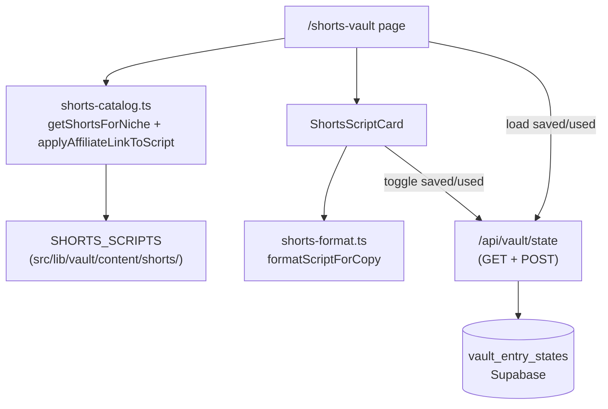

# Viral Shorts Vault Design

**Date:** 2026-08-12
**Status:** Approved for planning

## Summary

Add a premium feature at `/shorts-vault`: a curated library of 40 ready-to-film, faceless short-form video scripts (5 per niche across all 8 app niches), each a full production package with hook, timecoded beats, on-screen text, visual directions, caption, and hashtags. The user's affiliate link is injected into the caption via the existing `__LINK__` convention. Per-user "saved" and "used" state persists to Supabase, reusing the `vault_entry_states` table and `/api/vault/state` route already built for the Quora + Pinterest Vault.

## Goals

1. Give users copy-and-film scripts for TikTok, Instagram Reels, and YouTube Shorts with no writing, no AI cost, and no waiting.
2. Keep the barrier to posting as low as possible: every script is faceless, requiring no on-camera appearance.
3. Reuse the existing vault infrastructure (state table, state API, link substitution, niche picker, copy buttons) rather than building a parallel system.
4. Ship as a distinct, marketable premium feature with its own page and nav entry.

## Non-goals

- No AI generation. Content is static and curated. No LLM calls, no RapidAPI calls, no build/enrich pipeline.
- No personalization of script bodies to a specific offer. Scripts are niche-generic; only the affiliate link is substituted.
- No video rendering, editing, thumbnail generation, or asset pipeline. We ship text and directions only.
- No new database table. The existing `vault_entry_states` table is reused.
- No changes to the existing `/vault` page's content, filters, or behavior.
- No real tutorial Vimeo ID (placeholder `TutorialVideoSection`, consistent with other premium landings).
- No test runner. Verification is the content validator, TypeScript, lint, build, and a manual browser pass.

## Context: existing uncommitted vault

The repo contains a complete but **uncommitted** Copy-Paste Vault on branch `optimize/instant-income-speed`:

- `src/lib/vault/types.ts` — `VaultEntry` discriminated union (`quora` | `pinterest`), plus `VaultEntryState`, `VaultStateResponse`, `VaultStateUpdate`
- `src/lib/vault/catalog.ts` — `getVaultEntryById`, `isVaultEntryId`, `getVaultEntriesForNiche`, `applyAffiliateLink`
- `src/lib/vault/content/<niche>.ts` — 160 entries (10 Quora + 10 Pinterest per niche)
- `src/app/vault/page.tsx` — niche picker, platform filter, Saved only / Hide used, "X of Y used"
- `src/app/api/vault/state/route.ts` — GET and POST per-user state
- `supabase/migrations/20260812000002_vault_entry_states.sql` — `vault_entry_states` with per-user RLS
- `scripts/validate-vault.mjs` — content validator, wired as `npm run validate:vault`
- `src/lib/premium-features.ts` — registered as "Quora + Pinterest Vault" at `/vault`

Per user decision, this work stays uncommitted; the shorts work is added alongside it.

## Decisions (from brainstorming)

| Topic | Choice |
|---|---|
| Content source | Curated static, shipped in the repo. No AI, no scraping. |
| Script depth | Full production package: hook, timecoded beats, on-screen text, visual directions, CTA, caption, hashtags |
| Delivery style | Faceless-first only. Voiceover over stock footage, screen recordings, or text on screen. |
| Personalization | None beyond affiliate link injection. Scripts are niche-generic. |
| Browse model | Full browsable library, filtered by niche and platform. No daily drop, no countdown. |
| Vault size | 40 scripts: 5 per niche across all 8 niches |
| Per-user state | Supabase-backed (saved / used), reusing `vault_entry_states` |
| Placement | Own page at `/shorts-vault` with its own `PREMIUM_FEATURES` entry, reusing existing vault plumbing |
| Link substitution | Client-side, matching the existing vault's `applyAffiliateLink` pattern |
| Content separation | Shorts live in their own array, not in `VAULT_ENTRIES`, so they cannot leak into `/vault` |
| Test runner | None added |

## Architecture



Content is imported directly into the client component, so filtering and search are instant with zero network calls. The only network traffic is loading and updating per-user state.

## Data model

New file `src/lib/vault/shorts-types.ts`:

```ts
import type { NicheId } from "@/lib/niches";

export type ShortsPlatformTag = "tiktok" | "reels" | "shorts";

export type ShortsBeat = {
  timecode: string;   // "0:03-0:09"
  voiceover: string;  // what the voice says
  onScreen: string;   // the text overlay
  visual: string;     // the b-roll or screen-recording direction
};

export type ShortsScript = {
  id: string;                    // "s-pet-01"
  nicheId: NicheId;
  angle: string;                 // the specific take, e.g. "Beginner mistake"
  format: string;                // the structural template, one of the five below
  title: string;
  platforms: ShortsPlatformTag[];
  durationSeconds: number;       // 25-45
  hook: string;                  // spoken over the opening seconds
  beats: ShortsBeat[];           // 4-6 beats, starting where the hook ends
  cta: string;                   // spoken close, points to bio
  caption: string;               // post caption, contains __LINK__ exactly once
  hashtags: string[];            // 3-8, no leading "#"
  visualStyle: string;           // how to shoot it faceless
  soundNote: string;             // audio and music guidance
};
```

### Timing model

The `hook` is not a beat. It occupies the opening window from `0:00` to wherever the first beat starts, which is between 2 and 5 seconds depending on hook length. Beats then run contiguously from there to `durationSeconds`, with no gaps and no overlaps. So a 32-second script with a 3-second hook has beats spanning `0:03` to `0:32`.

This keeps the hook a first-class field — it is the single most important line, it gets its own emphasis in the card, and it is separately copyable — without duplicating it inside the beat list.

### Affiliate link placement

TikTok and Instagram Reels do not render clickable links in captions, so a spoken "click the link below" would be a dead end. Therefore:

- `caption` contains `__LINK__` **exactly once**. It works directly as a YouTube Shorts description, and elsewhere it is the link the user pastes into their bio.
- `cta` is the spoken close and points to the bio ("Link's in my bio if you want the full plan"). It contains no `__LINK__`.
- No spoken field (`hook`, `beats[].voiceover`, `beats[].onScreen`, `cta`) may contain `__LINK__`. A voiceover reading a raw URL aloud is wrong.

Substitution reuses `substituteLink` from `src/lib/hot-threads/ttl.ts`, which already strips the placeholder cleanly when the user has no affiliate link set.

## Content plan

40 scripts: 5 per niche across `make_money_online`, `weight_loss`, `health_fitness`, `beauty_skincare`, `relationships`, `tech_gadgets`, `pets`, `home_garden`.

Each niche gets the same five formats, so quality and variety stay even across niches:

| Format | Shape |
|---|---|
| Three mistakes | "Three mistakes people make with X." Numbered text on screen over simple b-roll. |
| Myth vs truth | Names a widely believed myth, then corrects it with what actually works. |
| POV story | Relatable first-person situation told through text on screen with ambient b-roll. |
| Screen demo | Screen recording walking through a tool, search, or process step by step. |
| Before and after | A timeline: where someone starts, what changes week by week, where they land. |

Constraints per script:

- 25 to 45 seconds, 4 to 6 beats, timecodes contiguous per the timing model above and ending exactly at `durationSeconds`
- `hook` at most 140 characters, so it can actually be spoken in the opening window
- Written generically for the niche so it works with any offer in that niche
- Faceless: every `visual` direction is achievable with stock footage, a screen recording, or text on screen
- `caption` within 2200 characters (TikTok's limit)
- 3 to 8 hashtags
- No duplicate hooks or captions anywhere in the library
- Same editorial voice as the existing vault content: plain, concrete, no hype, and honest about limits. Health, money, and pet-health claims must avoid guarantees and defer to professionals where the existing Quora content does.
- IDs follow the existing convention with an `s-` prefix: `s-mmo-01`, `s-wl-01`, `s-hf-01`, `s-bs-01`, `s-rel-01`, `s-tech-01`, `s-pet-01`, `s-hg-01`, numbered 01 through 05.

## Files

### New

| Path | Purpose |
|---|---|
| `src/lib/vault/shorts-types.ts` | `ShortsScript`, `ShortsBeat`, `ShortsPlatformTag` |
| `src/lib/vault/content/shorts/<niche>.ts` | 8 files, 5 scripts each. Kebab-case filenames matching the existing content files (`make-money-online.ts`, `weight-loss.ts`, and so on), each exporting `<NICHE>_SHORTS` to mirror the existing `<NICHE>_ENTRIES` convention |
| `src/lib/vault/content/shorts/index.ts` | `SHORTS_SCRIPTS` aggregated array |
| `src/lib/vault/shorts-catalog.ts` | `getShortsForNiche`, `getShortsScriptById`, `isShortsScriptId`, `applyAffiliateLinkToScript` |
| `src/lib/vault/shorts-format.ts` | `formatScriptForCopy` — pure script-to-plain-text formatter |
| `src/app/shorts-vault/page.tsx` | The page |
| `src/components/vault/ShortsScriptCard.tsx` | The card |
| `scripts/validate-shorts.mjs` | Content validator |

### Modified

| Path | Change |
|---|---|
| `src/lib/premium-features.ts` | Add `/shorts-vault` entry with `Clapperboard` icon |
| `src/app/api/vault/state/route.ts` | Widen ID check to accept shorts IDs |
| `package.json` | Add `"validate:shorts": "node scripts/validate-shorts.mjs"` |

### Untouched but reused

`vault_entry_states` table and migration, `substituteLink`, `NichePicker` (`src/components/ui/niche-picker.tsx`), `SelectableChip`, `CopyButton` (`src/components/dfy/copy-button.tsx`), `PageHeader`, `TutorialVideoSection`, `InlineError`, `Skeleton`, `useSearch` for `affiliateLink`.

## Catalog module

```ts
export function getShortsForNiche(
  nicheId: NicheId,
  platform?: ShortsPlatformTag | "all",
): ShortsScript[];

export function getShortsScriptById(id: string): ShortsScript | undefined;

export function isShortsScriptId(id: string): boolean;

export function applyAffiliateLinkToScript(
  script: ShortsScript,
  affiliateLink: string,
): ShortsScript;
```

Platform filtering matches by **array containment** (`script.platforms.includes(platform)`), not equality, since a script can target more than one platform. This differs from the existing vault, where `platform` is a single value.

`applyAffiliateLinkToScript` substitutes into `caption` only, returning a new object.

## Shared state API

`src/app/api/vault/state/route.ts` currently validates:

```ts
if (!entryId || !isVaultEntryId(entryId)) {
  return NextResponse.json({ error: "Valid entry required" }, { status: 400 });
}
```

This widens to accept either namespace:

```ts
if (!entryId || (!isVaultEntryId(entryId) && !isShortsScriptId(entryId))) {
  return NextResponse.json({ error: "Valid entry required" }, { status: 400 });
}
```

The GET handler needs no change: it returns all of the user's saved and used IDs, and each page only looks up the IDs it knows about. Because shorts IDs carry an `s-` prefix and existing IDs use `q-` and `p-`, the two namespaces cannot collide inside the shared table.

## Page

Route `/shorts-vault`, client component, mirroring `src/app/vault/page.tsx` in structure, shell, and motion.

Header: eyebrow `PREMIUM`, title "Viral Shorts <gradient>Vault</gradient>", subtitle naming the value plainly ("40 faceless scripts for TikTok, Reels, and Shorts. Pick one, read it, post it.").

Then `TutorialVideoSection` with no `videoId`, rendering the existing "Tutorial coming soon" placeholder.

Three numbered sections:

1. **Choose your niche** — `NichePicker`
2. **Filter the library** — platform chips (All, TikTok, Reels, Shorts), then "Saved only" and "Hide used" toggles, then an "X of Y used" counter
3. **Copy and film** — the card list

State and persistence:

- `localStorage` keys `acw.shorts-vault.niche` and `acw.shorts-vault.platform`, with the same hydration guard the vault page uses (`hydrated` flag so server and client render match)
- Saved and used sets loaded once from `GET /api/vault/state`
- `affiliateLink` from `useSearch()`
- Toggles are optimistic with rollback on failure, copied from the vault page's `patchState`

## Card

`ShortsScriptCard` renders:

- Header row: platform badges (TikTok / Reels / Shorts), duration, format label, and `angle`
- Title
- Hook, visually emphasized as the most important line, labeled as the first three seconds
- Beats as timecoded rows: timecode badge, `voiceover` as primary text, `onScreen` shown as an overlay chip, `visual` as muted supporting text
- CTA, plus `visualStyle` and `soundNote` in a small definition list
- Caption (with the affiliate link already substituted) and hashtags
- Copy buttons: **Copy full script** (primary), Copy caption, Copy hashtags, Copy hook
- Save and Mark used buttons, identical in look and behavior to `VaultEntryCard`

Behavior notes:

- Copying does **not** auto-mark a script as used. This matches the existing vault, where marking used is always explicit.
- Long scripts render fully rather than truncating, matching the existing vault cards which show full Quora answers.

### Copy format

`formatScriptForCopy(script)` is a pure function producing plain text suited to pasting into a notes app or teleprompter. Shape:

```
TITLE — 32s — TikTok / Reels / Shorts

HOOK (0:00-0:03)
<hook>

0:03-0:09
Say: <voiceover>
On screen: <onScreen>
Show: <visual>

...

CTA
<cta>

CAPTION
<caption with link substituted>

HASHTAGS
#one #two #three

HOW TO SHOOT IT
<visualStyle>

SOUND
<soundNote>
```

Because it is pure and takes the already-substituted script, it needs no knowledge of the affiliate link.

## Validation

`scripts/validate-shorts.mjs`, wired as `npm run validate:shorts`.

The existing `validate-vault.mjs` regex-parses TypeScript source, which cannot handle the nested `beats` array. Instead, this validator transpiles each content file with the already-installed `typescript` package (`ts.transpileModule`) and dynamically imports the result, validating the real objects. Content files import only types, and `import type` declarations are erased during transpilation, so the `@/` path alias never needs resolving. No new dependency.

It loads both `src/lib/vault/content/shorts/` and `src/lib/vault/content/` through the same transpile path, since the existing vault content files likewise import only types. That makes the cross-namespace ID collision check possible.

Checks:

- Exactly 5 scripts per niche, 40 total, and no unexpected `nicheId`
- Unique IDs across shorts, and no collision with any existing `VAULT_ENTRIES` ID
- `caption` contains `__LINK__` exactly once
- No `__LINK__` in `hook`, `cta`, or any `beats[].voiceover` / `beats[].onScreen` / `beats[].visual`
- `beats.length` between 4 and 6
- Timecodes parse, are contiguous with no gaps or overlaps, and end exactly at `durationSeconds`
- The first beat starts between 2 and 5 seconds, leaving a plausible hook window
- `durationSeconds` between 25 and 45
- `hook.length` at most 140
- `caption.length` at most 2200
- `hashtags.length` between 3 and 8, none containing `#` or whitespace
- `platforms` non-empty with only valid tags
- No duplicate hooks and no duplicate captions across the library
- Every required field non-empty

Failures print one line per issue and exit non-zero, matching the existing validator's output style.

## Verification

1. `npm run validate:shorts` passes with "40 entries across 8 niches"
2. `npm run validate:vault` still passes, proving shorts did not leak into `VAULT_ENTRIES`
3. `npx tsc --noEmit` clean
4. `npm run lint` clean
5. `npm run build` succeeds
6. Manual browser pass:
   - `/shorts-vault` renders; "Viral Shorts Vault" appears in the sidebar, the mobile More sheet, and the dashboard premium widget
   - Switching niche shows 5 scripts; platform chips filter correctly; a script tagged for multiple platforms appears under each of its tags
   - Niche and platform choices survive a reload
   - With an affiliate link set, it appears in the caption; with none set, the caption reads cleanly with no leftover placeholder
   - Copy full script produces the documented format; the other three copy buttons copy the right field
   - Save and Mark used persist across reload; "X of Y used" updates; "Saved only" and "Hide used" filter correctly
   - `/vault` still shows only Quora and Pinterest entries under its All filter, and its save/used state is unaffected
   - With the state API failing, the page still browses and copies, showing the inline error

## Risks

- **Content volume.** 40 full production packages is the bulk of the work. Mitigated by fixing five formats up front so each niche is a known, repeatable authoring task, and by the validator catching structural drift.
- **Shared table, two namespaces.** A future third content type must keep prefixing IDs distinctly. The `s-` / `q-` / `p-` convention and the validator's cross-array uniqueness check guard this.
- **Bundle size.** 40 scripts of text ship to the client on this route. It is code-split to `/shorts-vault` and comparable to the existing vault's 160 entries, so this is acceptable.
- **Building on uncommitted work.** The shorts feature depends on the untracked vault module and migration. Per user decision this is accepted; the two changes stay entangled until someone commits the vault.
